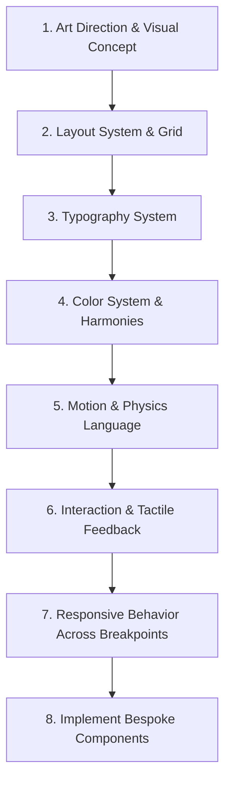

# 🎨 AGENT DESIGN RULES: High-End Creative & Engineering Standard

> **MANDATE**: NEVER CREATE GENERIC AI UI.
> Treat every project as an Awwwards / FWA candidate. Reject cliché templates, predictable SaaS formulas, and bland components.

---

## 🚫 1. STRICT AVOID LIST (Prohibited AI Clichés)

Do **NOT** implement:
- **Generic gradients**: Avoid default purple-to-blue or neon pink-to-cyan linear washes.
- **Excessive rounded cards**: Avoid nesting cards within cards with oversized radius and repetitive padding.
- **Glassmorphism by default**: Do not throw `backdrop-filter: blur()` on everything without narrative purpose.
- **Excessive pill buttons**: Do not make every clickable element a 9999px rounded pill button.
- **Inter / Roboto as default typography**: Avoid generic system fonts; select distinctive, high-personality typefaces (editorial serif, bespoke grotesque, elegant display).
- **Generic hero sections**: Headline + subheadline + 2 centered CTA buttons on a plain background.
- **Repetitive card grids**: 3 or 4 identical rectangular cards with a small circular icon and generic paragraphs.
- **Excessive floating drop shadows**: Diffuse heavy black shadows that make elements feel disconnected.
- **Random decorative blobs**: Pointless gradient blurs or abstract blobs placed behind text.
- **Meaningless floating shapes**: Random floating geometric shapes with no conceptual connection to the brand.
- **Excessive microtext**: Tiny unreadable captions and badges sprinkled everywhere.
- **Template-like layouts**: Cookie-cutter layouts that resemble generic Bootstrap or basic templates.
- **Predictable SaaS layouts**: Monotonous sidebar + dashboard or standard hero + logos + 3-column features + pricing table.

---

## 💎 2. MANDATORY REQUIREMENTS (Every Page Must Have)

Every page and view created or edited must embody:
1. **Strong Visual Concept**: A unifying artistic metaphor or theme rooted in the project's essence.
2. **Intentional Typography**: High contrast between display headings and functional body copy, paired with deliberate letter-spacing, line-height, and editorial weights.
3. **Distinctive Composition**: Asymmetric balance, editorial columns, overlapping visual layers, framing, and dynamic focal points.
4. **Editorial Hierarchy**: Clear visual storytelling where the most important element commands attention instantly.
5. **Meaningful Whitespace**: Generous, intentional breathing room that elevates perception of luxury and clarity.
6. **Custom Interaction**: Tactile hover states, micro-transitions, magnetic cues, cursor interactions, or audio-visual feedback.
7. **Responsive Art Direction**: Layouts that reflow thoughtfully for mobile rather than just stacking into an endless vertical column.
8. **Deliberate Motion**: Purposeful choreography (staggered entries, physics-based springs, parallax depth, smooth reveals).
9. **Visual Rhythm**: Alternating density—compact informational modules balanced by grand cinematic showcases.
10. **Clear Content Hierarchy**: Zero cognitive clutter; immediate clarity of value proposition, proof, and action.

---

## 🔄 3. STRICT EXECUTION WORKFLOW

**DO NOT START BY CREATING COMPONENTS.**

Follow this disciplined 7-step sequence before writing UI code:

1. **Art Direction**: Define tone, moodboard reference, aesthetic movement (e.g., Brutalist editorial, Haute Pâtisserie French luxury, Cyberpunk kinetic, Warm Bauhaus).
2. **Layout System**: Establish modular grid, asymmetrical guides, margins, and content boundaries.
3. **Typography System**: Pair distinctive display font with readable body font, setting fluid clamp scales.
4. **Color System**: Curate an evocative palette with precise dominant, supporting, accent, and ambient surface tones.
5. **Motion Language**: Define easing curves, timing, scroll-driven triggers, and transition styles.
6. **Interaction Language**: Design hover, active, focus, load, and feedback states.
7. **Responsive Behavior**: Map how complex compositions gracefully adapt to mobile, tablet, and ultra-wide screens.
8. **Component Implementation**: Only now assemble modular, reusable, high-craft components.

---

## 🏆 4. AWARD-WINNING RESEARCH PROTOCOL (Before Designing)

Before designing any website or major module:

1. **Research Award-Winning References**:
   - Study recent winners and nominees from **Awwwards (Site of the Day/Month)**, **FWA**, **CSS Design Awards**, and **Webby Awards**.
2. **Systematic Analysis**:
   - **Typography**: What pairings, sizes, and tracking are pushing boundaries?
   - **Composition**: How do elements overlap, bleed off-screen, or anchor the viewport?
   - **Navigation**: Is navigation minimal, floating, fullscreen drawer, or contextual?
   - **Transitions**: How do pages and sections transition seamlessly?
   - **Scrolling**: Scroll-driven storytelling, horizontal galleries, velocity skewing, or pinned stages.
   - **Image Treatment**: Duotones, masks, grain overlays, chromatic aberration, or custom canvas shaders.
   - **Interaction**: Micro-feedback, draggable elements, cursor tracking.
   - **Motion**: Timing, stagger delays, spring physics, and SVG line animations.
   - **Responsive Behavior**: How does the experience maintain luxury and wonder on small touchscreens?
3. **NO PLAGIARISM**:
   - **DO NOT COPY ANY WEBSITE.**
   - Extract core design principles, deconstruct techniques, and synthesize an **original, bespoke visual language** tailored specifically to the project.

---

## 🛠️ 5. RECOMMENDED TECH STACKS BY PROJECT ARCHETYPE

### A. Web Corporativa Premium
- **Framework**: Next.js (App Router) + TypeScript
- **Styling**: Tailwind CSS / Vanilla CSS Design Tokens
- **Motion**: GSAP 3 (ScrollTrigger, Flip) + Motion (motion.dev)
- **Quality Gate**: Lighthouse Performance > 90, zero layout shift (CLS = 0).

### B. E-Commerce Premium / Boutique
- **Framework**: Next.js + TypeScript
- **Styling**: Tailwind CSS + Custom CSS Variables
- **Motion**: GSAP + Motion (cart drawers, product visual transitions)
- **Conversion**: Dynamic real-time configurators, WhatsApp / Stripe direct checkout.

### C. Experiencia Inmersiva / Awwwards Candidate
- **Framework**: Next.js + TypeScript
- **3D & Canvas**: Three.js + React Three Fiber (@react-three/fiber, @react-three/drei)
- **Shaders**: GLSL custom fragment & vertex shaders for liquid, distortion, or particle effects
- **Animation**: GSAP Timeline + Lenis Smooth Scroll
